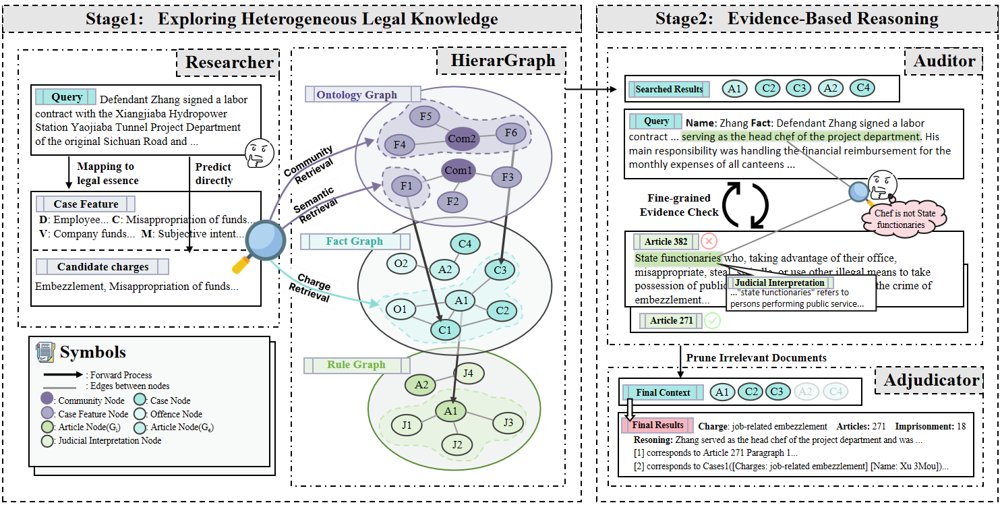

# **LegalGraphRAG: Vietnamese Civil Law Analysis**

> A Vietnamese Civil Law analysis system that integrates multi-agent graph retrieval and supports legal resolution based on reference cases and articles.

---

## 🚀 **Highlights**
- ✅ **Vietnamese Legal Knowledge Graph**: Integrates Vietnamese Civil Code, Labor Code, and Social Insurance Law into a knowledge graph.
- ✅ **API Server**: Includes a FastAPI server (`api_server.py`) with a web interface (`web/index.html`) for interactive legal analysis.
- ✅ **Automated Retrieval**: Retrieves similar cases and relevant laws from the graph based on user facts.
- ✅ **Generative Analysis**: Uses LLMs to analyze civil disputes, determine applicable laws, and propose resolution directions.

<p align="center">
  
</p>

---

## 🧩 **Project Structure**

```text
LegalGraphRAG/
├── api_server.py              # FastAPI server for Vietnamese Civil Law
├── web/                       # Frontend web interface
├── core/                      # Core modules for Graph RAG
├── scripts/                   # Data fetch and generation scripts
│   ├── fetch_vn_legal_data.py # Fetches VN law from HuggingFace
│   ├── generate_sample_cases.py # Generates synthetic VN cases
│   └── visualize_graph.py     # Generates graph visualization (Pyvis)
├── raw_data/                  # Vietnamese raw law corpus
├── datas/                     # Generated knowledge graph features
├── archive_cn_data/           # Original Chinese datasets backup
├── env.example                # Configuration file template
└── README.md                  # Project documentation
```

---

## 🛠️ **Usage**

### 1️⃣ Environment Setup

```bash
# Install dependencies
pip install -r requirements.txt
pip install fastapi uvicorn pydantic pyvis

# Copy and configure environment file
cp env.example .env
# Edit .env with your model API keys
```

### 2️⃣ Data Preparation

Run the following scripts to prepare the Vietnamese dataset and knowledge graph:

```bash
# 1. Fetch Vietnamese legal data
python scripts/fetch_vn_legal_data.py

# 2. Generate synthetic sample cases
python scripts/generate_sample_cases.py
```

### 3️⃣ Running the API and Web UI

Start the FastAPI backend:
```bash
python api_server.py
```
Open your browser and navigate to: `http://localhost:8000/`

### 4️⃣ Visualizing the Graph

To generate an interactive HTML view of the knowledge graph:
```bash
python scripts/visualize_graph.py
```
This will create a `graph_view.html` file that can be opened in any browser.

---

## ⚙️ **Configuration**
Configuration is managed via `.env`. See `env.example` for the full configuration list, specifically Model APIs used by `api_server.py`.
