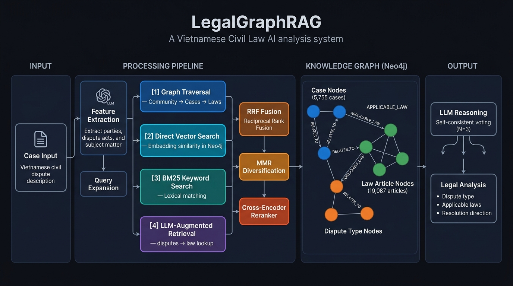

# LegalGraphRAG — Vietnamese Civil Law Analysis System

> **Graph-augmented Retrieval-Augmented Generation (RAG) for Vietnamese Civil Law**, enabling AI-powered legal analysis by combining a structured knowledge graph, multi-strategy retrieval, and LLM reasoning.

<p align="center">
  
</p>

---

## 📌 Overview

**LegalGraphRAG** is an end-to-end AI system that assists with Vietnamese civil dispute resolution. Given a case description, the system automatically:

1. **Extracts** key legal features from the case facts (parties, dispute acts, subject matter)
2. **Retrieves** the most relevant precedent cases and applicable legal articles from a structured knowledge graph
3. **Re-ranks** candidates using a cross-encoder reranker and Reciprocal Rank Fusion (RRF)
4. **Generates** a structured legal analysis with applicable laws and proposed resolution direction using an LLM

The system covers three major Vietnamese legal domains: **Civil Code**, **Labor Code**, and **Social Insurance Law**.

---

## 🧠 Technical Highlights

### Architecture

| Layer | Component | Description |
|---|---|---|
| **Knowledge Graph** | Neo4j | Stores case nodes, law article nodes, and dispute-type nodes with vector embeddings |
| **Retrieval** | `GraphRetriever` | Multi-strategy: graph traversal, direct vector search, BM25, and LLM-augmented retrieval |
| **Fusion** | RRF + MMR | Reciprocal Rank Fusion for merging results; Maximal Marginal Relevance for diversity |
| **Re-ranking** | Cross-encoder | Sentence-transformer reranker for final candidate scoring |
| **Reasoning** | LLM Judge | Self-consistent voting across N generations to produce stable legal analysis |
| **API** | FastAPI | REST API with a web UI for interactive case submission and result visualization |

### Multi-Strategy Retrieval Pipeline

```
Case Input
    │
    ├─► Feature Extraction (LLM) → Query Expansion
    │
    ├─► [1] Graph Traversal:   Community → Cases → Laws
    ├─► [2] Direct Vector Search: Embedding similarity in Neo4j
    ├─► [3] BM25 Keyword Search
    └─► [4] Augmented Retrieval: LLM-extracted disputes → Law lookup
         │
         └─► RRF Fusion → MMR Diversification → Cross-encoder Reranker
                  │
                  └─► LLM Analysis with Self-Consistent Voting → Final Output
```

### Supported LLMs

| Category | Models |
|---|---|
| **Cloud API** | DeepSeek V3, GPT-4o Mini, Gemini 2.0 Flash, Gemini 2.0 Flash Lite |
| **Local (HuggingFace)** | Qwen3, Qwen2.5, Gemma3, InternLM3, GLM-4 |

---

## 🛠️ Tech Stack

- **Backend**: Python, FastAPI, Uvicorn
- **Graph Database**: Neo4j (with vector index support)
- **ML/NLP**: PyTorch, HuggingFace Transformers, Sentence-Transformers, LangChain
- **Search**: BM25 (`rank_bm25`), vector similarity, NetworkX for graph traversal
- **LLM APIs**: OpenAI SDK, Google GenAI SDK
- **DevOps**: Docker, Docker Compose, pre-commit hooks, pytest

---

## 📊 Evaluation Results

> All results are measured on **`tiny_eval`** — 5 Vietnamese Labour Law cases curated to cover diverse dispute types. Model: **DeepSeek V3** via API, embedding: `text-embedding-3-small`.

### Retrieval Benchmark (Law Article Retrieval)

| System | Hit@1 | Hit@3 | Hit@5 | Recall@5 | MRR |
|---|:---:|:---:|:---:|:---:|:---:|
| BM25 Lexical RAG | 12.5% | 37.5% | 37.5% | 31.3% | 0.208 |
| Hybrid RAG (No Graph) | 50.0% | 62.5% | 62.5% | 42.7% | 0.563 |
| Naive Vector RAG | 62.5% | 62.5% | 75.0% | 48.9% | 0.656 |
| **LegalGraphRAG (Proposed)** | **62.5%** | **87.5%** | **87.5%** | **61.5%** | **0.708** |

> **LegalGraphRAG achieves the highest Hit@3, Hit@5, Recall@5, and MRR**, significantly outperforming all baselines in ranked retrieval quality.

### Generation Quality (LLM-Judged)

| System | Faithfulness (1–5) | Answer Relevance (1–5) | Citation Precision | Hallucination Rate |
|---|:---:|:---:|:---:|:---:|
| Zero-Shot LLM (No RAG) | 4.50 | 4.80 | 70.8% | 0.0% |
| Naive Vector RAG | 4.00 | 4.65 | 75.0% | 12.5% |
| Hybrid RAG (No Graph) | 4.19 | 4.69 | 56.2% | **25.0%** |
| **LegalGraphRAG (Proposed)** | **4.06** | **4.62** | **75.0%** | **12.5%** |

> LegalGraphRAG matches Naive Vector RAG in Citation Precision (75.0%) while reducing Hybrid RAG's hallucination rate by **2×**.

### Ablation Study — Retrieval Component Analysis

| Configuration | Description | Dispute Acc | Law F1 | Time/case |
|---|---|:---:|:---:|:---:|
| **Graph_Full** | Community + Direct + Augment retrieval | **100%** | 13.71% | 21.4s |
| Graph_No_Augment | Community + Direct (no LLM augment) | 100% | **20.71%** | 16.8s |
| Graph_Direct_Only | Semantic vector retrieval only | 100% | 19.05% | 16.9s |
| Vector_Hybrid (Baseline) | BM25 + Vector, no graph | 100% | 21.57% | 17.2s |
| Graph_Community_Only | Graph community traversal only | 100% | 0.00% | 13.2s |

> All configurations achieve **100% Dispute Accuracy** (correct dispute type identification), validating the robustness of the multi-agent reasoning pipeline.

---

## 📁 Project Structure

```text
LegalGraphRAG/
├── core/
│   ├── LegalGraphRAG.py          # Main orchestrator class
│   ├── pipeline.py               # End-to-end analysis pipeline
│   ├── config.py                 # Dataclass-based configuration system
│   ├── retriever/
│   │   ├── graph_retriever.py    # Multi-strategy retrieval (Graph + Vector + BM25)
│   │   ├── vector_retriever.py   # Pure vector similarity retrieval
│   │   └── reranker.py           # Cross-encoder re-ranking
│   ├── graph_construct/          # Graph building, Neo4j manager, embedding utils
│   ├── models/                   # LLM adapters (OpenAI, Gemini, local transformers)
│   ├── judge/                    # Legal analysis & self-consistent voting
│   ├── prompt/                   # Prompt templates (Vietnamese/English)
│   └── utils/                    # RRF, MMR, legal text preprocessing, logging
├── api/                          # FastAPI route handlers
├── web/                          # Frontend (HTML/JS/CSS)
├── scripts/                      # Data prep, evaluation, and analysis scripts
├── tests/                        # Unit and integration tests
├── data/                         # Knowledge graph data (cases, law articles)
├── main.py                       # Application entry point
├── docker-compose.yml            # One-command environment setup
└── env.example                   # Environment variable template
```

---

## 🚀 Getting Started

### Method 1: Docker (Recommended)

The fastest way to get the full stack running (Neo4j + FastAPI backend):

```bash
# 1. Configure environment
cp env.example .env
# Edit .env: set LLM API keys (DEEPSEEK_API_KEY, OPENAI_API_KEY, or GEMINI_API_KEY)

# 2. Launch all services
docker-compose up -d --build
```

The app will be available at **`http://localhost:8000`**.

### Method 2: Manual Setup

```bash
# 1. Install dependencies
pip install -r requirements.txt

# 2. Configure environment
cp env.example .env
# Edit .env with your API keys and Neo4j connection string

# 3. Start the server
python main.py
```

Navigate to **`http://localhost:8000`** to access the web interface.

---

## ⚙️ Configuration

All settings are managed via `.env`. Key configuration groups:

| Group | Key Variables | Purpose |
|---|---|---|
| **Model** | `MODEL_NAME`, `DEEPSEEK_API_KEY`, `OPENAI_API_KEY`, `GEMINI_API_KEY` | LLM selection and authentication |
| **Neo4j** | `NEO4J_URI`, `NEO4J_USERNAME`, `NEO4J_PASSWORD` | Graph database connection |
| **Retrieval** | `TOP_RETRIEVE_TOP_K`, `DIRECT_RETRIEVE_TOP_K`, `USE_RERANKER` | Retrieval pipeline tuning |
| **Generation** | `TEMPERATURE`, `MAX_LENGTH`, `USE_SELF_CONSISTENT` | LLM inference parameters |

See [`env.example`](env.example) for the full list of options with descriptions.

---

## 🧪 Testing

```bash
# Run full test suite with coverage
pytest --cov=core tests/

# Run a specific test module
pytest tests/test_retriever.py -v
```

---

## 📄 License

This project is for research and educational purposes.
