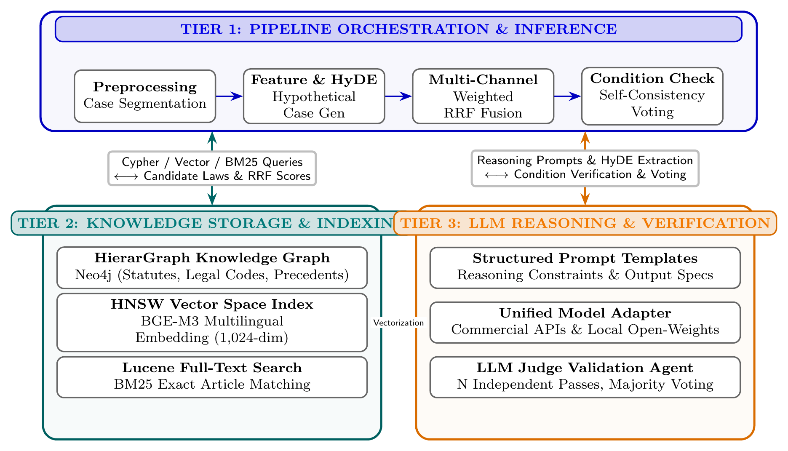
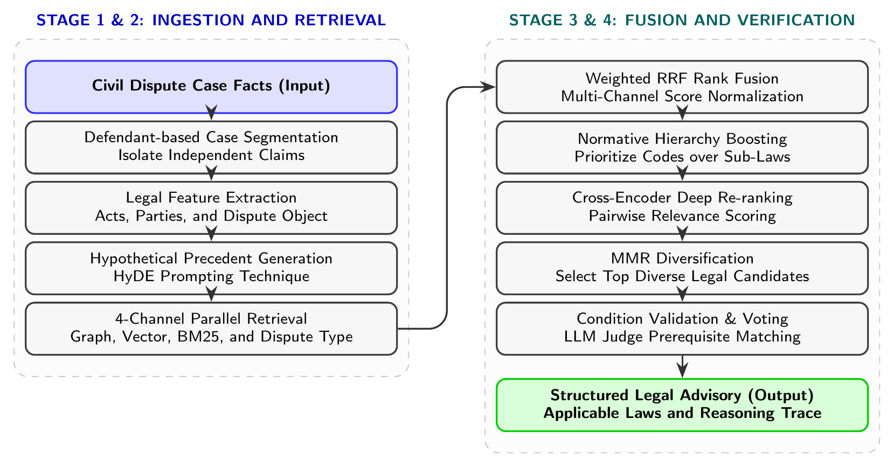

# LegalGraphRAG: Graph-Augmented RAG for Vietnamese Civil Law

[](https://www.python.org/)
[](https://neo4j.com/)
[](https://fastapi.tiangolo.com/)
[](https://pytorch.org/)
[](LICENSE)
[](tests/)

> **LegalGraphRAG** is an end-to-end, graph-augmented Retrieval-Augmented Generation (RAG) system tailored for Vietnamese civil dispute resolution. By integrating a multi-tier statutory knowledge graph (**HierarGraph**), 4-channel hybrid retrieval, and an independent legal condition validation agent (**LLM Judge**), the system resolves vocabulary mismatches, eliminates fragmented rule retrieval, and suppresses LLM hallucinations with fully traceable reasoning paths.

---

## 🏛️ System Architecture

The system operates across three cohesive layers designed for high modularity, scalability, and verifiable reasoning:

<p align="center">
  
</p>

1. **Pipeline & Orchestration Layer (Top)**: Handles input case segmentation, HyDE (Hypothetical Document Embeddings) feature extraction, multi-channel retrieval coordination, and self-consistency voting.
2. **Knowledge Storage & Indexing Layer (Bottom Left)**:
   - **HierarGraph (Neo4j)**: Multi-layer graph modeling statutory hierarchies (*Legal Codes $\to$ Articles $\to$ Precedent Cases*), housing **12,879 legal articles** and **667 precedent court judgments**.
   - **HNSW Vector Index**: High-dimensional semantic representations powered by **BGE-M3** (1,024 dimensions).
   - **Lucene BM25 Index**: Exact lexical matching for specific legal codes and statutory identifiers.
3. **LLM Reasoning & Verification Layer (Bottom Right)**: Structured prompt templates, universal adapters for cloud and open-weight models, and an autonomous **LLM Judge** performing condition matching (`judge_dep`) with multi-pass voting.

---

## 🔄 End-to-End Pipeline Dataflow

<p align="center">
  
</p>

The inference workflow is structured into four sequential stages:

```
Case Facts Description
      │
      ▼
[Stage 1: Ingestion & Feature Extraction]
  ├── Multi-defendant & dispute segmentation
  ├── Legal feature extraction (Parties, Dispute acts, Subject matter)
  └── HyDE hypothetical judgment generation
      │
      ▼
[Stage 2: 4-Channel Parallel Retrieval]
  ├── [1] Graph Traversal: Community detection (Louvain) & precedent linkage
  ├── [2] Semantic Vector Search: BGE-M3 dense embeddings in Neo4j
  ├── [3] Lexical Search: BM25 exact keyword & article matching
  └── [4] Query Expansion: LLM-identified potential dispute types
      │
      ▼
[Stage 3: Fusion & Candidate Diversification]
  ├── Weighted Reciprocal Rank Fusion (Weighted RRF)
  ├── Normative Hierarchy Boosting (prioritizing Codes > Decrees > Circulars)
  ├── Cross-Encoder Deep Re-ranking
  └── Maximal Marginal Relevance (MMR) diversification (top candidates)
      │
      ▼
[Stage 4: Condition Validation & Advisory Generation]
  ├── Prerequisite condition checking against statutory constraints (`judge_dep`)
  ├── Multi-pass Self-Consistency Voting (N=3 independent passes)
  └── Final Structured Advisory Report with verifiable legal citations
```

---

## 📊 Comprehensive Benchmark Evaluation

All models were evaluated on **`tiny_eval`**, a benchmark of 5 in-depth Vietnamese labor dispute cases reflecting complex judicial litigation (unilateral contract termination, salary arrears, occupational accident compensation, pregnant employee dismissal, and unlawful wage deductions). Ground truth legal citations were derived directly from court judgments and independently verified by legal experts (Cohen's Kappa = **0.92**).

### Multi-Dimensional Performance Comparison

The table below summarizes the multi-dimensional evaluation comparing **LegalGraphRAG** against keyword search, dense vector retrieval, standard hybrid retrieval, and zero-shot generation across retrieval accuracy, generation fidelity, and reasoning explainability:

| Approach | Hit@5 | Recall@5 | MRR | Citation Precision | Hallucination Rate | TCR (Traceable Correct Rate) |
|---|:---:|:---:|:---:|:---:|:---:|:---:|
| **BM25 Lexical RAG** | 37.5% | 31.3% | 0.208 | — | — | 0.0% |
| **Naive Vector RAG** | 75.0% | 48.9% | 0.656 | 75.0% | 12.5% | 0.0% |
| **Hybrid RAG (No Graph)** | 62.5% | 42.7% | 0.563 | 56.2% | 25.0% | 0.0% |
| **Zero-Shot LLM (No RAG)** | — | — | — | 70.8% | 0.0%* | 0.0% |
| **LegalGraphRAG (Proposed)** | **87.5%** | **61.5%** | **0.708** | **75.0%** | **12.5%** | **91.3%** |

*\*Zero-Shot LLM records 0.0% hallucination solely because it lacks reference documents to misquote; however, its recommendations remain abstract and lack applicable statutory grounds.*

### 🔍 Key Scientific Insights

1. **Superior Statutory Recall (+25.8% vs Naive Vector)**: Naive vector search suffers from vocabulary mismatch and misses compensatory penalty provisions that reside far from the factual description in embedding space. By traversing relational edges between precedents and statutes, LegalGraphRAG automatically recovers interconnected articles (e.g., liability provisions following unlawful termination).
2. **Hallucination Suppression (50% Reduction vs Hybrid RAG)**: Merging BM25 and vector retrieval without structural filtering causes noise saturation, inflating Hybrid RAG's hallucination rate to 25.0%. LegalGraphRAG pre-validates each candidate rule against statutory conditions (`judge_dep`), cutting hallucinations down to **12.5%** while retaining **75.0%** citation precision.
3. **Auditable Explainability (91.3% TCR)**: While standard RAG baselines operate as black boxes (**0.0% TCR**), **91.3%** of correct laws retrieved by LegalGraphRAG possess transparent graph paths from case facts through precedent nodes to applicable statutes.

---

## 🤖 Supported Language Models

| Tier | Supported Models |
|---|---|
| **Cloud APIs** | DeepSeek V3 / R1, OpenAI (GPT-4o, GPT-4o-mini), Google Gemini (Gemini 2.0 Flash, Flash Lite) |
| **Local / Open-Source** | Qwen 2.5 / 3, Gemma 2 / 3, InternLM 3, GLM-4 (via HuggingFace / vLLM / Ollama) |
| **Embeddings** | BGE-M3 (`BAAI/bge-m3`, 1024-dim dense vector), OpenAI `text-embedding-3-small` |
| **Re-ranker** | Cross-Encoder (`cross-encoder/ms-marco-MiniLM-L-6-v2` / multilingual variant) |

---

## 🛠️ Tech Stack

- **Core Logic & API**: Python 3.10+, FastAPI, Uvicorn, Pydantic v2
- **Knowledge Graph Database**: Neo4j 5.14+ (Graph storage + native Vector Index)
- **Graph Algorithms & NLP**: NetworkX (Louvain community detection), PyTorch, HuggingFace Transformers, Sentence-Transformers, `rank_bm25`
- **Testing & Quality**: Pytest, Pytest-cov (**87.6% unit test coverage** across 47 core test cases)
- **Containerization**: Docker, Docker Compose

---

## 📁 Repository Structure

```text
LegalGraphRAG/
├── core/
│   ├── LegalGraphRAG.py         # Main orchestrator & high-level interface
│   ├── pipeline.py              # End-to-end case analysis pipeline
│   ├── config.py                # Dataclass-based configuration system
│   ├── retriever/
│   │   ├── graph_retriever.py   # 4-channel retrieval (Graph + Vector + BM25 + Expansion)
│   │   ├── vector_retriever.py  # Standalone vector similarity search
│   │   └── reranker.py          # Cross-encoder re-ranking module
│   ├── graph_construct/         # HierarGraph builder, Neo4j client, BGE-M3 embedding utils
│   ├── judge/                   # LLM Judge condition verification & Self-Consistency voting
│   ├── models/                  # Unified model adapters (DeepSeek, OpenAI, Gemini, HF)
│   ├── prompt/                  # Structured legal prompt templates
│   └── utils/                   # Weighted RRF, MMR diversification, confidence scoring
├── api/                         # FastAPI route definitions & schemas
├── web/                         # Interactive web dashboard (HTML, CSS, JS)
├── data/                        # Processed civil law corpora & precedent case datasets
├── docs/                        # Graduation thesis, LaTeX source, and technical papers
│   └── doan/latex/              # Full LaTeX thesis source and compiled main.pdf
├── images/                      # High-resolution architectural diagrams
├── scripts/                     # Benchmark runners, data synchronization, evaluation tools
├── tests/                       # Automated unit and integration test suite
├── docker-compose.yml           # Multi-container service definitions (FastAPI + Neo4j)
├── Dockerfile                   # Backend production container image
├── env.example                  # Environment variable configuration template
├── main.py                      # Application entry point
└── requirements.txt             # Python dependencies
```

---

## 🚀 Quick Start

### Option 1: Docker Compose (Recommended)

Start the entire system (FastAPI application + Neo4j 5.14 graph database) with a single command:

```bash
# 1. Clone repository and navigate to directory
git clone https://github.com/dkhoid/LegalGraphRAG.git
cd LegalGraphRAG

# 2. Setup environment file
cp env.example .env
# Edit .env and supply your preferred API key (e.g., DEEPSEEK_API_KEY or OPENAI_API_KEY)

# 3. Launch services
docker-compose up -d --build
```

The web dashboard will be available at **`http://localhost:8000`**, and the Neo4j browser at **`http://localhost:7474`**.

### Option 2: Local Setup

#### Prerequisites
- Python 3.10 or later
- Running Neo4j 5.14+ instance (with APOC plugin enabled)

```bash
# 1. Create and activate virtual environment
python3 -m venv venv
source venv/bin/activate  # On Windows: venv\Scripts\activate

# 2. Install dependencies
pip install -r requirements.txt

# 3. Configure environment
cp env.example .env
# Set NEO4J_URI, NEO4J_USERNAME, NEO4J_PASSWORD, and your LLM API keys

# 4. Synchronize graph data (first run only)
python sync_neo4j.py

# 5. Start the application
python main.py
```

---

## ⚙️ Key Configuration Options

All parameters are configured via environment variables or `.env`. Notable settings:

| Parameter | Default | Description |
|---|:---:|---|
| `MODEL_NAME` | `deepseek-chat` | Target LLM model (`deepseek-chat`, `gpt-4o-mini`, `gemini-2.0-flash`, etc.) |
| `NEO4J_URI` | `bolt://localhost:7687` | Connection URI for Neo4j instance |
| `TOP_RETRIEVE_TOP_K` | `10` | Number of candidate articles retained per retrieval channel |
| `FINAL_TOP_K` | `5` | Maximum number of laws passed to generation context |
| `USE_RERANKER` | `True` | Enable Cross-Encoder candidate re-ranking |
| `USE_SELF_CONSISTENT` | `True` | Enable multi-pass self-consistency voting in LLM Judge |
| `SELF_CONSISTENT_N` | `3` | Number of independent reasoning passes for voting |

---

## 🧪 Testing & Validation

Execute the automated test suite with coverage reporting:

```bash
# Run full unit and integration test suite
pytest --cov=core tests/

# Run retriever-specific tests
pytest tests/test_retriever.py -v
```

The test suite covers **47 test cases** spanning mathematical rank fusion algorithms (RRF, MMR), prerequisite condition checking (`judge_dep`), and graph traversal routines with **87.6% code coverage**.

---

## 📚 Citation & Academic Background

This project represents the practical realization of the undergraduate research thesis in Information Technology:

- **Thesis**: *Hệ thống hỏi đáp pháp luật dựa trên đồ thị tri thức* (Legal Question Answering System Based on Knowledge Graphs)
- **Author**: Dang Dang Khoi (MSSV: 2351010104)
- **Advisor**: Dr. Le Viet Tuan
- **Institution**: Department of Knowledge Engineering, Faculty of Information Technology, Ho Chi Minh City Open University

If you use this repository or its methodology in your research, please cite:

```bibtex
@thesis{dang2026legalgraphrag,
  author       = {Dang, Dang Khoi},
  title        = {Hệ thống hỏi đáp pháp luật dựa trên đồ thị tri thức (Legal Question Answering System Based on Knowledge Graphs)},
  school       = {Ho Chi Minh City Open University},
  year         = {2026},
  type         = {Undergraduate Thesis},
  advisor      = {Le, Viet Tuan}
}
```

---

## 📄 License

This repository is distributed under the **MIT License**. See [`LICENSE`](LICENSE) for more details.
